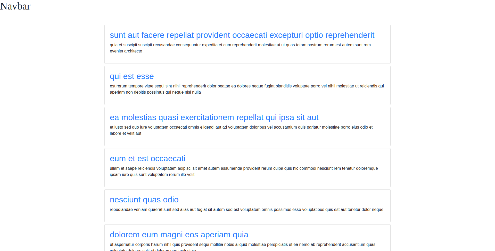

# proyect-nuxt-01



* API: https://jsonplaceholder.typicode.com/

## Build Setup

```bash
# install dependencies
$ npm install

# serve with hot reload at localhost:3000
$ npm run dev

# build for production and launch server
$ npm run build
$ npm run start

# generate static project
$ npm run generate
```

For detailed explanation on how things work, check out [Nuxt.js docs](https://nuxtjs.org).

--------------------------------------------------------------------------------------------

# NUXT - Vue.js con súper Poderes!
- Introducción a Nuxt.js
- Qué es Nuxt?
- Instalación de un nuevo proyecto de Nuxt
- Rutas con Nuxt
- Rutas dinámicas con Nuxt
- NuxtLink
- Layout
- Página de Error 404
- Agregar CSS adicionales
- SEO - Configurando el head
- Práctica: Traer Artículos a nuestro blog
- Práctica: Página detalle blog
- Práctica: Conociendo Async Data
- Archivos Terminados de esta sección
